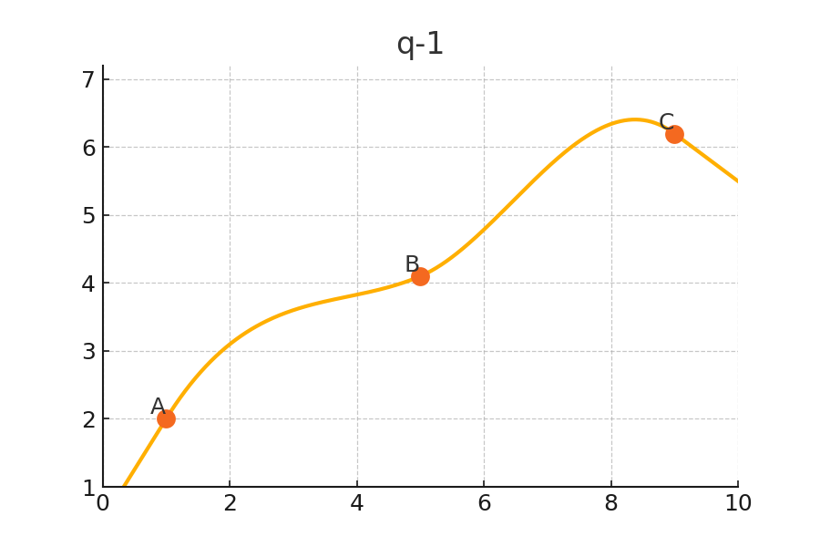
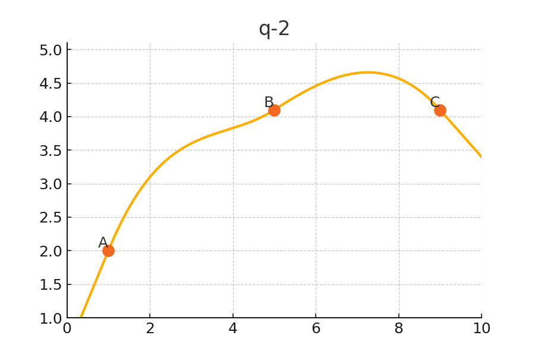
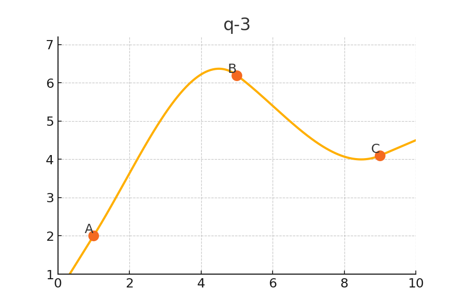
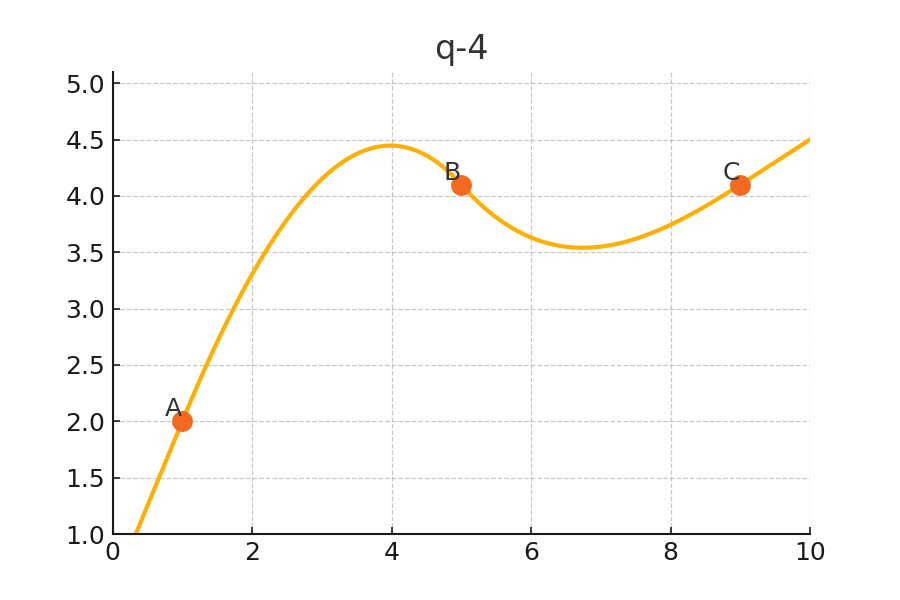
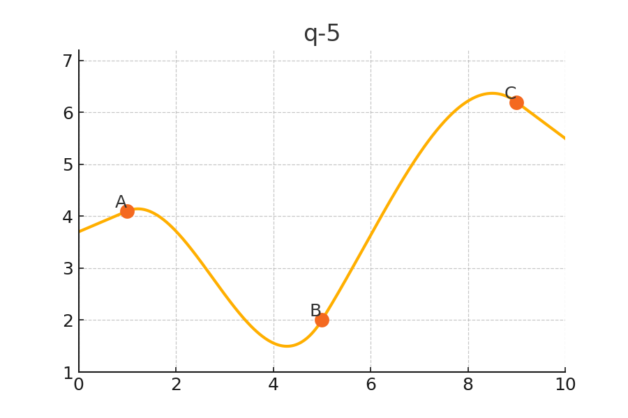

# Problem Set: First Five Problems (with Choices)

## q-1: Rate of Change of Density in Non-Uniform Foam

Scientists measured the density of a highly non-uniform, experimental porous foam sample as a function of distance along its length and plotted the results on the diagram below. Due to the irregular structure of the foam, the density fluctuates greatly from point to point along the sample. The diagram shows the density curve with three marked positions, labeled A, B, and C. The researchers are interested in knowing how rapidly the density is changing at each of these three positions.

**Which of the following best describes the ranking of how quickly the density is changing at points A, B, and C?**

*Clarification:* When ranking the rate of change, remember that a negative rate of change is ranked lower than a positive rate of change.

**Choices**
- A > B > C
- A < B < C
- A > C > B
- B > A > C

**Solution**

The rate of change at each point is determined by the slope of the curve at that position. The steeper the slope (positive or negative), the greater the rate of change. Remember, the rate of change refers to how quickly the density value increases or decreases at each point, not the actual density value itself. A positive rate of change means the density is increasing, while a negative rate means it is decreasing. Negative rates of change are always ranked lower than positive ones. For this question, the correct ranking is: $A > B > C$.

## q-2: Speed Ranking of a Nano-Drone in Unpredictable Environment

A group of researchers tracked the position of a nano-drone as it navigated through a highly unpredictable environment. They plotted the position of the drone as a function of time on the diagram below. Because the drone’s movement is influenced by sudden gusts and obstacles, its path varies significantly over time. The diagram marks three moments in time—A, B, and C—on the position vs. time curve. The team needs to determine at which moment the drone is moving the fastest.
**Which of the following most accurately ranks the speed (rate of change of position) of the drone at points A, B, and C?**

*Clarification:* When ranking the rate of change, remember that a negative rate of change is ranked lower than a positive rate of change.

**Choices**
- B > A > C
- C > A > B
- A > C > B
- B > C > A

**Solution**

The rate of change of position is the speed of the drone at each marked point, corresponding to the steepness of the curve (slope) at each location. To rank the speed, we compare how rapidly the drone’s position is changing at A, B, and C. A larger slope (steeper curve) means a faster speed. Negative slopes (downward movement) are considered lower than positive ones. For this problem, the correct ranking is: $B > A > C$.

## q-3: Temperature Change Rate Along a Non-Uniform Rod

Students measured the temperature at various points along a long, non-uniform metal rod and plotted their findings as temperature versus distance on the diagram below. Because the rod is made from metals with different properties fused together, the temperature changes in a highly irregular way along its length. On the graph, points A, B, and C are marked. The students are interested in knowing at which position the temperature is changing most rapidly.
**Which of the following best represents the ranking of the rate of change of temperature at points A, B, and C?**

*Clarification:* When ranking the rate of change, remember that a negative rate of change is ranked lower than a positive rate of change.

**Choices**
- B > C > A
- C > B > A
- A > C > B
- B > A > C

**Solution**

The rate of temperature change at each point is indicated by the slope of the temperature vs. distance curve at points A, B, and C. Steeper slopes indicate faster changes. When ranking these, remember negative slopes (decreasing temperature) are always lower than positive slopes (increasing temperature). The correct ranking is: $B > C > A$.

## q-4: Brightness Rate of Change in a Bioluminescent Organism

Scientists observed the brightness of a newly discovered bioluminescent organism as it glowed over time and plotted their results in the diagram below. Since the organism’s light production fluctuates due to changes in its internal chemistry, the brightness curve varies considerably. The graph shows three points in time labeled A, B, and C. The researchers want to know at which moment the brightness is changing the most quickly.
**Which of the following best describes the order of how rapidly the brightness is changing at points A, B, and C?**

*Clarification:* When ranking the rate of change, remember that a negative rate of change is ranked lower than a positive rate of change.

**Choices**
- A > B > C
- C > A > B
- A > C > B
- B > C > A

**Solution**

The rate at which the brightness is changing at each point is given by the slope of the curve at that point. Positive slopes represent increasing brightness, while negative slopes represent decreasing brightness. Negative rates of change should be ranked lower than positive rates. For this question, the correct ranking is: $A > B > C$.

## q-5: Rate of Change of Nanoparticle Concentration

Researchers measured the concentration of synthesized nanoparticles suspended in a special solution as a function of distance from one end of the container. The material is non-uniform, so the concentration changes in unpredictable ways along the distance, as shown in the diagram below. Points A, B, and C are marked on the concentration vs. distance curve. The scientists are interested in which position shows the greatest change in concentration.
**Which of the following best ranks the rate at which the concentration is changing at points A, B, and C?**

*Clarification:* When ranking the rate of change, remember that a negative rate of change is ranked lower than a positive rate of change.

**Choices**
- C > A > B
- C > B > A
- B > C > A
- A > C > B

**Solution**

The rate of change at each position is determined by the steepness of the curve at points A, B, and C. Larger positive slopes mean a greater increase in concentration, while negative slopes represent a decrease and are ranked lower. The correct ranking here is: $C > A > B$.

